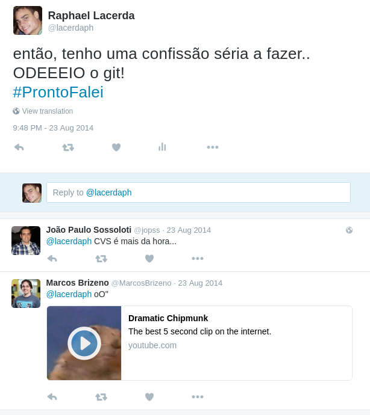
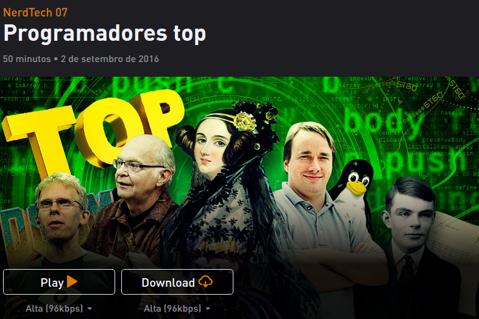
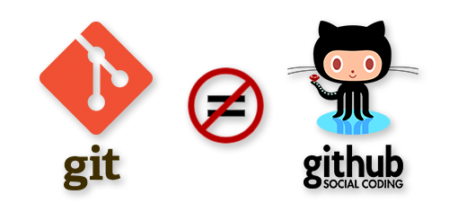
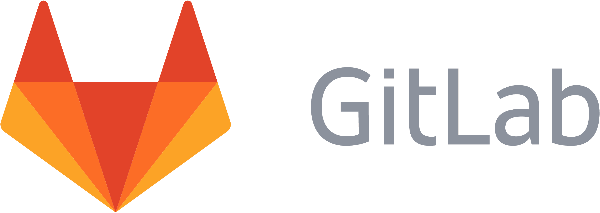
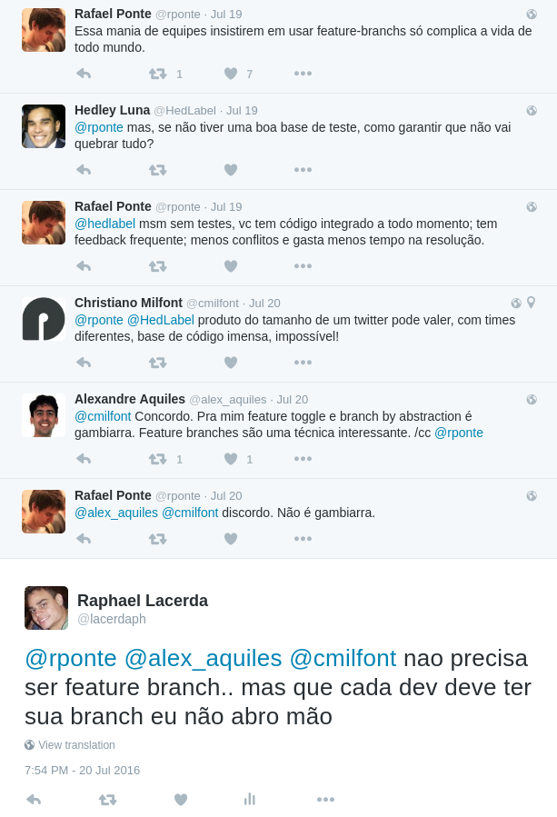
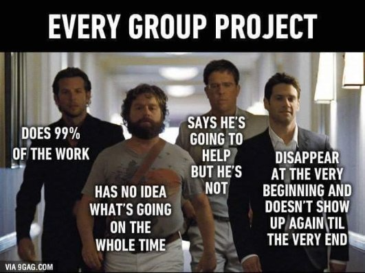
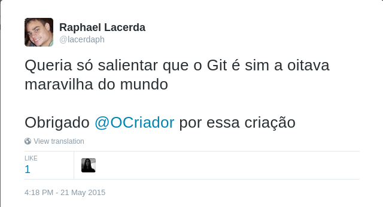

# Apresentação GIT

## Walkthrough
* O que é?
* Rede social
* Hello world
* Repositórios locais e remotos
* Trabalhando com branches
* Trunk base x Feature Branch
* Pull Request

## "This thing called GIT"

* Segundo [**Linus Torvalds**](https://www.ted.com/talks/linus_torvalds_the_mind_behind_linux?language=en)

* [TOP frases do Linus em discussões](http://www.attendly.com/linux-founder-linus-torvalds-delivers-a-smackdown-like-no-other/)

> *".. Take Concurrent Versions System (CVS) as an example of what not to do; if in doubt, make the exact opposite decision ... "*

> *".. GIT is my second big project, which was only created for me to mantain my first big project... "* 

### (pequeno parênteses)

## Rede Social

## Hello world  

* clone
* add
* commit
* push
* pull
* checkout

## Local x remotos

* origin
* head
* branch -a
* remote -v

### múltiplos Repositórios

## Trabalhando com branches

* git checkout -b nova
* merge
* rebase

## Trunk X Feature

[Acompanhe aqui](https://twitter.com/lacerdaph/status/755898667308048384)

## Outros comandos

* log
* show
* diff
* gitk

# FIM

## Links interessantes

* Comandos [git](https://medium.freecodecamp.com/git-cheat-sheet-and-best-practices-c6ce5321f52#.1oxi5pmms).
* Meu [gist](https://gist.github.com/raphaelLacerda/687db0162a610f63d13ae899ec680518)