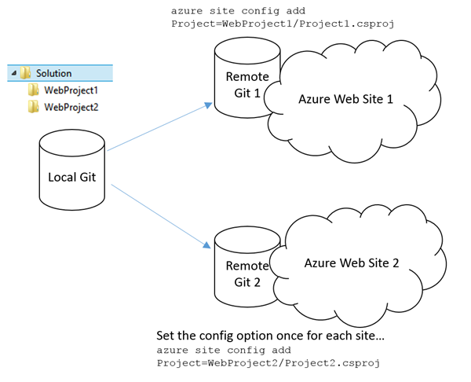
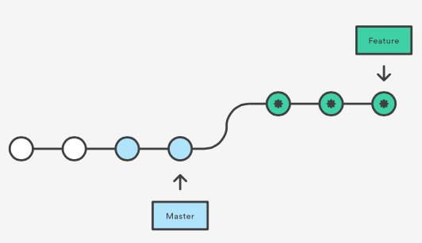
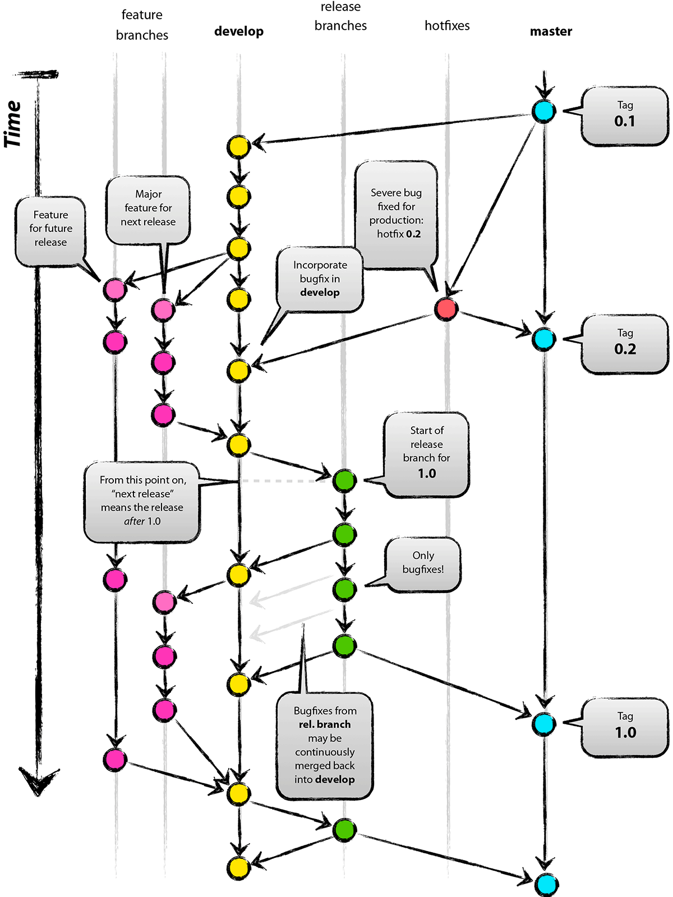

# Apresentação GIT

> *"...distributed is the new centralized..."*
 

## Walkthrough
* O que é?
* Rede social
* Hello world
* Repositórios locais e remotos
* Trabalhando com branches
* Trunk base x Feature Branch
* Pull Request

## "This thing called GIT"

* Segundo [**Linus Torvalds**](https://www.ted.com/talks/linus_torvalds_the_mind_behind_linux?language=en)

* [TOP frases do Linus em discussões](http://www.attendly.com/linux-founder-linus-torvalds-delivers-a-smackdown-like-no-other/)

> *".. Take Concurrent Versions System (CVS) as an example of what not to do; if in doubt, make the exact opposite decision ... "*

#### em outras palavras...

> *".. GIT is my second big project, which was only created for me to mantain my first big project... "* 

### "This is Hell"

### (pequeno parênteses)

## Rede Social

## Hello world  

* clone
* add
    * untracked
    * staged -> rastreado mas não gravado
	* separando seus commits

 

* commit
    * -am
* push
* pull
* checkout

## Local x remotos

* origin
* head
* branch 
    * -a
    * -v
* remote -v
* reset --hard --soft

### múltiplos Repositórios

## Trabalhando com branches

* git checkout -b nova
* merge
* rebase
* Ferramentas - [meld merge](http://meldmerge.org/)

### branch fácil - "the merge option"
* git checkout iss53
* git merge master

### "rebase is better"

* git checkout iss53
* git rebase master

> *"The major benefit of rebasing is that you get a much cleaner project history. First, it eliminates the unnecessary merge commits required by git merge."*

#

> *"Now, to the question of whether merging or rebasing is better: hopefully you’ll see that it’s not that simple. Git is a powerful tool, and allows you to do many things to and with your history, but every team and every project is different. Now that you know how both of these things work, it’s up to you to decide which one is best for your particular situation."*

### branch hell

## Trunk X Feature

### 

### Trunk com **Feature toogle**

[Acompanhe aqui](https://twitter.com/lacerdaph/status/755898667308048384) essa discussão!!

## BUT... "Who is the boss?"

## Outros comandos

* log
    * --stat
* show
* diff
* gitk

# FIM

## Links interessantes

* Comandos [git](https://medium.freecodecamp.com/git-cheat-sheet-and-best-practices-c6ce5321f52#.1oxi5pmms).
* Meu [gist](https://gist.github.com/raphaelLacerda/687db0162a610f63d13ae899ec680518)

